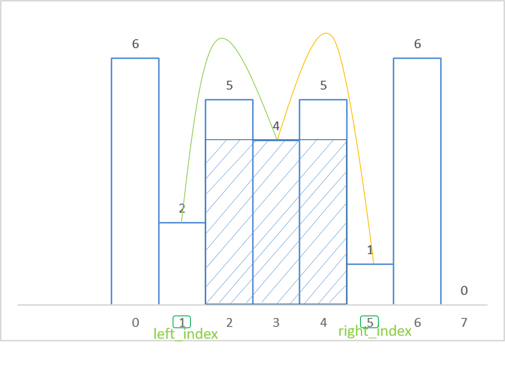

    Author:            cuckoo
    Date:              2017/03/29 21:41:01
    Update:            
    Problem:           Largest Rectangle in Histogram
    Difficulty:        Hard
    Source:            https://leetcode.com/problems/largest-rectangle-in-histogram/#/description

__Solution Step__:
 - [stack](https://discuss.leetcode.com/topic/15541/short-c-solution-use-stack-ac-28ms)  
 
 - [more detail](http://www.geeksforgeeks.org/largest-rectangle-under-histogram/)

=======
 - [Divide and Conque](https://discuss.leetcode.com/topic/7491/simple-divide-and-conquer-ac-solution-without-segment-tree)
