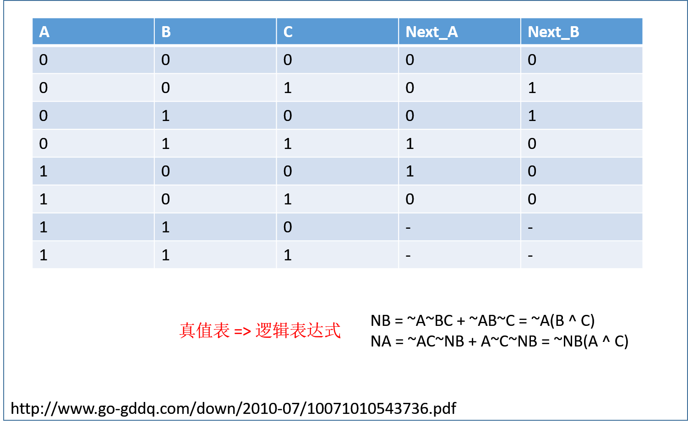

    Author:            cuckoo
    Date:              2017/05/18 08:36:28
    Update:            
    Problem:           Single Number II
    Difficulty:        Medium
    Source:            https://leetcode.com/problems/single-number-ii/#/description

#### Solution Step
 - [Single Number](https://leetcode.com/problems/single-number/#/description)

#### Discuss
 - [Bit manipulation](https://discuss.leetcode.com/topic/2031/challenge-me-thx/106)
   
 - [Easy Understand](https://discuss.leetcode.com/topic/43166/java-o-n-easy-to-understand-solution-easily-extended-to-any-times-of-occurance)
 - [Easy Understand- More concise](https://discuss.leetcode.com/topic/35640/java-easy-version-to-understand)
 - [Other](https://discuss.leetcode.com/category/145/single-number-ii)
